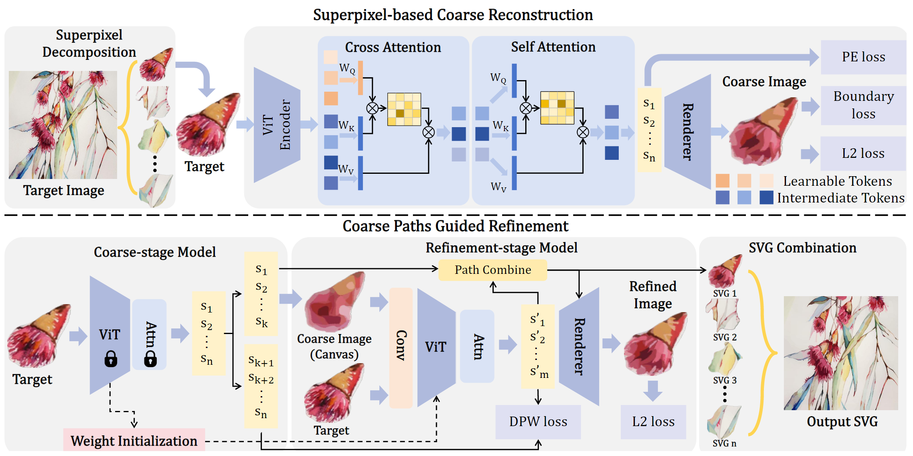

# SuperSVG: Superpixel-based Scalable Vector Graphics Synthesis

### [Paper](https://openaccess.thecvf.com/content/CVPR2024/papers/Hu_SuperSVG_Superpixel-based_Scalable_Vector_Graphics_Synthesis_CVPR_2024_paper.pdf) | [Suppl](https://openaccess.thecvf.com/content/CVPR2024/supplemental/Hu_SuperSVG_Superpixel-based_Scalable_CVPR_2024_supplemental.pdf)

[Teng Hu](https://github.com/sjtuplayer),
[Ran Yi](https://yiranran.github.io/),
[Baihong Qian](https://github.com/CherryQBH),
[Jiangning Zhang](https://zhangzjn.github.io/),
[Paul L. Rosin](https://scholar.google.com/citations?hl=zh-CN&user=V5E7JXsAAAAJ),
and [Yu-Kun Lai](https://scholar.google.com/citations?user=0i-Nzv0AAAAJ&hl=zh-CN&oi=sra)



This repository keeps a practical coarse-to-refine inference pipeline for generating SVG paths from raster images.

Reference implementation: [sjtuplayer/SuperSVG](https://github.com/sjtuplayer/SuperSVG)

## Overview

- **Task**: raster image to SVG path synthesis
- **Pipeline**:
  1. Coarse superpixel decoding (`decode_by_id_map`)
  2. Global SLIC-based refinement (`global_slic_refine_once`)
  3. Optional gradient-based fine-tuning (`fine_tune`)
- **Main entry**: `inference.py`
- **Default output size**: `512 x 512`

## Project Structure

```text
SuperSVG/
├── inference.py          # main inference script
├── models/               # model definitions
├── util/                 # utility modules
├── weights/              # checkpoints
├── test_images/          # sample inputs
├── output/               # default output directory
└── diffvg/               # rendering backend
```

## Environment Setup

The project is tested with Python 3.7 + PyTorch and depends on diffvg.

### 1) Create environment

```bash
conda create -n supersvg python=3.7 -y
conda activate supersvg
conda install -y pytorch torchvision -c pytorch
conda install -y numpy scikit-image
conda install -y -c anaconda cmake
conda install -y -c conda-forge ffmpeg
pip install svgwrite svgpathtools cssutils numba torch-tools scikit-fmm easydict visdom
pip install opencv-python==4.5.4.60
# Optional: required for automatic weight download from Hugging Face
pip install huggingface_hub
```

### 2) Build diffvg

```bash
cd diffvg
git submodule update --init --recursive
python setup.py install
cd ..
```

## Checkpoints

You can use either manual download or automatic download.

### Option A) Manual download

Download weights from:

- [Hugging Face: JTUplayer/SuperSVG](https://huggingface.co/JTUplayer/SuperSVG)

Then place the required files under `weights/`:

- Coarse model: `weights/coarse.pt`
- Refine model: `weights/refine.pt`

### Option B) Automatic download (recommended)

If local checkpoints are missing, `inference.py` will automatically download:

- `weights/coarse.pt`
- `weights/refine.pt`

from the default Hugging Face repo `JTUplayer/SuperSVG`.

Install the dependency first:

```bash
pip install huggingface_hub
```

You can also override the source repo:

```bash
python inference.py --hf_repo_id JTUplayer/SuperSVG
```

## Inference

Run single image or a folder:

```bash
python inference.py \
  --input_path test_images \
  --output_dir output \
  --device cuda \
  --path_num 1000 \
  --optimize_iter 10
```

## Web interface

Start the compact browser UI from the repository root:

```bash
python server.py
```

Then open `http://localhost:8000`. The interface supports drag-and-drop image
import, vectorization settings, input/SVG wipe comparison, zoom, pan, and SVG
export. FastAPI and Uvicorn must be installed in the active environment.

## Docker GPU deployment

The Docker image is GPU-only. It uses CUDA 12.1, CUDA-enabled PyTorch, and a
CUDA build of diffvg. It listens on the platform's `PORT` environment variable
(default `7860`) and fails at startup when no NVIDIA GPU is available.

```bash
docker build -t supersvg .
docker run --rm --gpus all -p 8000:7860 -v supersvg-data:/data supersvg
```

Or use Compose:

```bash
docker compose up --build
```

Open `http://localhost:8000`. The image deliberately excludes the 900 MB local
`weights/` directory. Required checkpoints are downloaded once from Hugging
Face into `/data/huggingface`; mount `/data` as persistent storage to reuse them
across container restarts. Per-request inputs and outputs use automatically
deleted temporary directories.

The server refuses new vectorization jobs when either its cache filesystem or
temporary filesystem has less than 2 GB free. Override this threshold with
`SUPERSVG_MIN_FREE_GB` if the deployment has a different storage policy.

### Platform notes

- **Hugging Face Spaces:** choose the Docker SDK and GPU hardware. The exposed
  port is `7860`. Persistent `/data` storage is optional but prevents checkpoint
  downloads after restarts.
- **Google Cloud:** deploy to a GPU-enabled Cloud Run service or GKE node. The
  platform supplies `PORT`; configure one NVIDIA GPU for the container.
- **AWS:** use ECS/EKS on an NVIDIA GPU instance and expose container port
  `7860`. App Runner does not provide GPU instances. Attach persistent storage
  at `/data` when checkpoint reuse is desired.

Local Docker requires the NVIDIA Container Toolkit and a working `nvidia-smi`.

### Important Arguments

- `--input_path`: image file or image folder
- `--output_dir`: output directory
- `--device`: `cuda` or `cpu`
- `--path_num`: target SVG path number
- `--optimize_iter`: optional fine-tune iterations after rendering
- `--ckpt_dir`: checkpoint folder (default `weights`)
- `--refine_paths_per_segment`: expected paths generated per refine segment
- `--refine_batch_size`: batch size for refine inference

### Input Format

Supported image extensions:

- `.jpg`
- `.jpeg`
- `.png`
- `.bmp`
- `.webp`

## Output

For each input image, the script saves:

- Raster output with the original filename (for example, `cat.jpg` -> `cat.jpg`)
- SVG output with the original stem name (for example, `cat.jpg` -> `cat.svg`)

and prints:

- per-image MSE
- final active path count
- average MSE and total rendering time

## Notes

- CUDA is recommended for practical inference speed.
- If `--path_num` is too high, latency increases significantly.
- In the refine stage, a fallback strategy is used to fill missing paths when SLIC region counts are not exact.

## Citation

If you use the original SuperSVG idea, please cite the official paper/repository:

```bibtex
@inproceedings{hu2024supersvg,
  title={SuperSVG: Superpixel-based Scalable Vector Graphics Synthesis},
  author={Teng Hu and Ran Yi and Baihong Qian and Jiangning Zhang and Paul L. Rosin and Yu-Kun Lai},
  booktitle={Proceedings of the IEEE Conference on Computer Vision and Pattern Recognition},
  year={2024}
}
```
